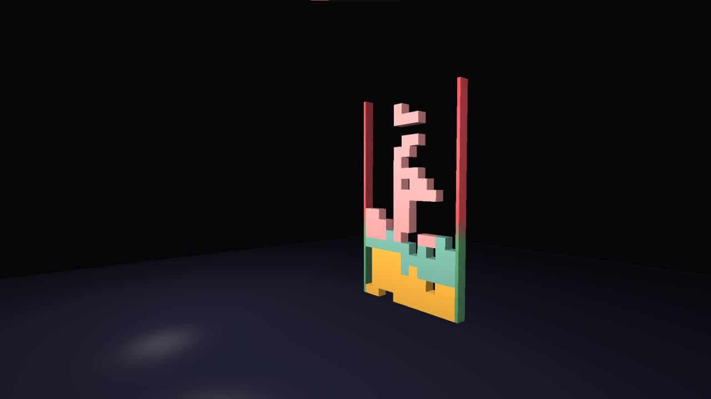

# FRTEngine

###Controls

`ESC` - exit the game

#####Tetromino

`arrow up` - instantly drop tetromino 
`other arrows` - move tetromino 
`Z`/`X` - rotate tetromino counterclockwise/clockwise 

#####Camera

`WASD` - move 
`TFGH` - change angle of view 
`I` - reset position and rotation
